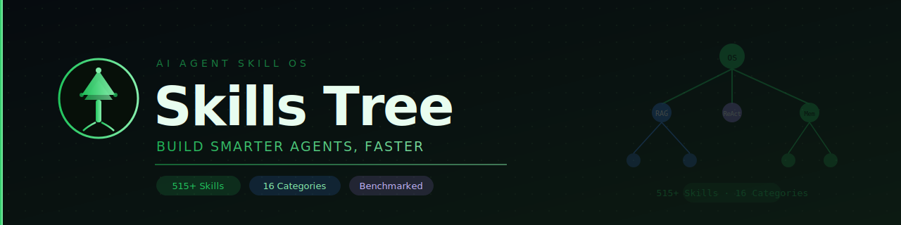

<div align="center">

<picture>
  <source media="(prefers-color-scheme: dark)" srcset="https://raw.githubusercontent.com/SamoTech/skills-tree/main/docs/assets/logo-dark.svg">
  
</picture>

# Skills Tree



<!-- HIGHLIGHTS_START -->
## 📆 This Week's Highlights — April 14, 2026

> No skill changes this week. Open a PR to get started!

<!-- HIGHLIGHTS_END -->


### The AI Agent Skill OS — Build Smarter Agents, Faster

> **515+ production-ready skills. 16 categories. Versioned, benchmarked, and evolving.**  
> **Stop rediscovering. Start building on what the community has already proven.**

[](https://github.com/SamoTech/skills-tree/stargazers)
[](https://github.com/SamoTech/skills-tree/network)
[](https://github.com/SamoTech/skills-tree/watchers)
[](https://github.com/SamoTech/skills-tree)
[](https://github.com/SamoTech/skills-tree/issues)
[](CONTRIBUTING.md)
[](https://github.com/SamoTech/skills-tree/graphs/contributors)
[](https://github.com/SamoTech/skills-tree/commits/main)
[](https://github.com/SamoTech/skills-tree)
[](https://github.com/SamoTech/skills-tree/actions/workflows/validate-skills.yml)
[](LICENSE)
[](skills/)
[](meta/CHANGELOG.md)
[](https://samotech.github.io/skills-tree)

**[🌐 Browse Live UI](https://samotech.github.io/skills-tree) · [🗺️ Systems](systems/) · [🏗️ Blueprints](blueprints/) · [📊 Benchmarks](benchmarks/) · [🔬 Labs](labs/) · [🤝 Contribute](CONTRIBUTING.md) · [🗺 Roadmap](meta/ROADMAP.md)**

🌐 **Read in your language:**
🇬🇧 English
· [🇸🇦 العربية](i18n/README.ar.md)
· [🇨🇳 中文](i18n/README.zh.md)
· [🇪🇸 Español](i18n/README.es.md)
· [🇩🇪 Deutsch](i18n/README.de.md)
· [🇫🇷 Français](i18n/README.fr.md)
· [🇮🇳 हिन्दी](i18n/README.hi.md)
· [🇯🇵 日本語](i18n/README.ja.md)
· [🇰🇷 한국어](i18n/README.ko.md)
· [🇧🇷 Português](i18n/README.pt.md)
· [🇷🇺 Русский](i18n/README.ru.md)

</div>

---

## The Problem

Every AI agent builder rediscovers the same skills from scratch.

Someone learns RAG the hard way. Someone else figures out memory injection at 2am. A third person spends a week benchmarking ReAct vs LATS — and never shares the results. A fourth discovers the same failure modes you already hit last month.

**That collective knowledge is disappearing into Slack threads, private repos, and Twitter bookmarks.**

Skills Tree fixes that.

---

## What This Is

**Skills Tree is the shared operating system for AI agent capabilities.**

A living, versioned, community-powered index of everything an agent can do — documented with working code, real benchmarks, failure modes, and evolution history. Every skill is production-ready. Every system shows how skills combine. Every benchmark is reproducible.

It's not a list. It's infrastructure.

---

## What's Inside

```
skills-tree/
│
├── skills/          → 515+ atomic, production-ready skill files
├── systems/         → Multi-skill workflows (research agent, code reviewer...)
├── blueprints/      → Copy-paste production architectures
├── benchmarks/      → Head-to-head, reproducible skill comparisons
├── labs/            → Experimental & bleeding-edge capabilities
│
├── docs/            → Interactive web UI (GitHub Pages)
├── i18n/            → Localized READMEs (Arabic, Chinese, Spanish, German, French, Hindi, Japanese, Korean, Portuguese, Russian)
├── meta/            → Schema, glossary, frameworks, roadmap, changelog
└── requirements.txt → Pinned Python deps for CI workflows
```

---

## 🗂️ The 16 Skill Categories

| # | Category | Skills | What It Covers |
|---|---|---|---|
| 01 | 👁️ **Perception** | 36 | Text, images, PDFs, code, sensors, databases, screens |
| 02 | 🧠 **Reasoning** | 41 | Planning, deduction, abduction, causal chains, commonsense |
| 03 | 🗄️ **Memory** | 26 | Working, episodic, semantic, vector, injection, forgetting |
| 04 | ⚡ **Action Execution** | 37 | File I/O, HTTP, email, shell, database writes |
| 05 | 💻 **Code** | 42 | Write, run, debug, review, refactor, test, deploy |
| 06 | 💬 **Communication** | 28 | Summarize, translate, draft, argue, adapt tone |
| 07 | 🔧 **Tool Use** | 55 | 55+ APIs — GitHub, Slack, Stripe, OpenAI, MCP, A2A |
| 08 | 🎭 **Multimodal** | 25 | Images, audio, video, VQA, 3D, charts |
| 09 | 🤖 **Agentic Patterns** | 36 | ReAct, CoT, ToT, MCTS, LATS, RAG, Debate |
| 10 | 🖥️ **Computer Use** | 37 | Click, type, scroll, OCR, terminal, VM, a11y tree |
| 11 | 🌐 **Web** | 28 | Search, scrape, crawl, login, fill forms, parse RSS |
| 12 | 📊 **Data** | 18 | ETL, SQL, embeddings, time series, anomaly detection |
| 13 | 🎨 **Creative** | 27 | Copywriting, image prompts, SVG, music, scripts |
| 14 | 🔒 **Security** | 20 | Sandboxing, secret scanning, audit logs, rollback |
| 15 | 🎼 **Orchestration** | 29 | Multi-agent, state machines, retry, consensus |
| 16 | 🏺 **Domain-Specific** | 52 | Medical, legal, finance, DevOps, education, science |

---

## A Skill in 60 Seconds

Every skill file is self-contained and production-ready:

````markdown
# Memory Injection
Category: memory | Level: intermediate | Stability: stable | Version: v2

## Description
Dynamically inject relevant past memories into an agent's system prompt
before each turn — giving the model user context without filling the window.

## Example
```python
client.messages.create(
    system=f"{base_system}\n\n## Memory\n{top_k_memories}",
    messages=[{"role": "user", "content": user_message}]
)
```

## Benchmarks  → benchmarks/memory/injection-strategies.md
## Related     → working-memory.md · rag.md · vector-store-retrieval.md
## Changelog   → v1 (2025-03) · v2 (2026-04, added retrieval scoring)
````

Every skill includes:
- ✅ What it does and why it matters
- ✅ Typed inputs/outputs
- ✅ Runnable Python code (`claude-opus-4-5` / `gpt-4o`)
- ✅ Frameworks table (LangChain, LangGraph, CrewAI, mem0...)
- ✅ Failure modes and edge cases
- ✅ Related skills cross-links
- ✅ Version history

---

## Skill Versioning — How Evolution Works

Skills are not static files. They evolve as the community learns:

```
v1 — Initial entry: description + minimal example
v2 — Enriched: better example + failure modes + related skills
v3 — Battle-tested: benchmarks + model comparison + production notes
```

**To upgrade a skill:**
1. Bump the version in frontmatter
2. Add a changelog entry explaining what improved
3. Open a PR titled `improve: skill-name — v1 → v2`

The best versions surface naturally — through PR merge frequency and inclusion in Systems + Blueprints.

---

## 🗺️ Systems — Multi-Skill Workflows

See how skills combine into real, working agent pipelines:

| System | Skills Used | Use Case |
|---|---|---|
| [Research Agent](systems/research-agent.md) | Web search + RAG + Summarize + Cite | Deep research automation |
| [Coding Agent](systems/coding-agent.md) | Code reading + Write + Debug + Test | End-to-end code generation |
| [Code Reviewer](systems/code-reviewer.md) | Code reading + Reasoning + Comment gen | Automated PR reviews |
| [Data Pipeline Agent](systems/data-pipeline-agent.md) | DB reading + ETL + Anomaly detection | Automated data ops |
| [Customer Support Bot](systems/customer-support-bot.md) | Memory injection + Intent + Response gen | Personalized support |
| [Computer Use Agent](systems/computer-use-agent.md) | Screen reading + OCR + Click + Type | Full GUI automation |
| [Data Analyst](systems/data-analyst.md) | SQL + Charts + Summarize + Insight gen | Automated data analysis |
| [Voice Agent](systems/voice-agent.md) | Audio transcription + NLU + TTS | Real-time voice interaction |

---

## 🏗️ Blueprints — Production Architectures

Copy-paste architectures for the most common agent patterns:

| Blueprint | Description |
|---|---|
| [RAG Stack](blueprints/rag-stack.md) | Embed → store → retrieve → generate, fully wired |
| [Multi-Agent Workflow](blueprints/multi-agent-workflow.md) | Sequential orchestration with handoffs |
| [Multi-Agent Mesh](blueprints/multi-agent-mesh.md) | N specialists + orchestrator, parallel execution |
| [Computer Use Browser](blueprints/computer-use-browser.md) | Browser automation via Playwright + vision |
| [Human-in-the-Loop](blueprints/human-in-the-loop.md) | Approval gates, escalation, audit trails |
| [Self-Healing Agent](blueprints/self-healing-agent.md) | Error detection, retry logic, rollback |
| [Memory-First Agent](blueprints/memory-first-agent.md) | Profile + episodic + vector memory combined |

---

## 📊 Benchmarks — Real Numbers, Reproducible

We test so you don't have to:

| Benchmark | Winner | Margin | Link |
|---|---|---|---|
| ReAct vs LATS (HotpotQA) | LATS | +8.3% accuracy | [→](benchmarks/reasoning/react-vs-lats.md) |
| RAG retrieval strategies | HyDE | +12% recall | [→](benchmarks/memory/rag-retrieval-strategies.md) |
| Memory injection methods | Top-K semantic | Best cost/quality ratio | [→](benchmarks/memory/injection-strategies.md) |
| Function calling comparison | Claude 3.7 | +6% on tool accuracy | [→](benchmarks/tool-use/function-calling-comparison.md) |

> Every benchmark includes methodology, dataset, and reproducible test scripts.

---

## 🏆 This Week's Highlights

> Auto-updated weekly · [Full leaderboard →](meta/LEADERBOARD.md)

**🔥 Most Active Skills**
- `skills/09-agentic-patterns/react.md` — 12 community improvements this month
- `skills/03-memory/memory-injection.md` — v2 with retrieval scoring
- `skills/02-reasoning/causal.md` — new benchmark comparison added

**⚡ Battle-Tested** *(used in 10+ public projects)*
`ReAct` · `Chain of Thought` · `RAG Pipeline` · `Memory Injection` · `Tool Use`

**🔬 Hot in Labs**
- `labs/reasoning/tree-of-agents.md` — multi-agent tree search
- `labs/memory/episodic-compression.md` — lossy-but-useful memory compression
- `labs/tool-use/adaptive-tool-selection.md` — dynamic tool filtering for large registries

---

## 🤝 How to Contribute

Four types of contributions — all valued:

| Type | What It Is | PR Title Format |
|---|---|---|
| **New Skill** | A capability not yet indexed | `feat: add [skill] to [category]` |
| **Skill Upgrade** | Bump v1→v2 with better content | `improve: [skill] — v1→v2` |
| **Benchmark** | Head-to-head with real numbers | `benchmark: [skill-a] vs [skill-b]` |
| **System / Blueprint** | Multi-skill workflow or architecture | `system: add [name]` |

```bash
git clone https://github.com/SamoTech/skills-tree.git
cp meta/skill-template.md skills/05-code/my-new-skill.md
# Fill in every section → open a PR
```

### Quality Rules

- ❌ No generic prompts or vague descriptions
- ❌ No skills without a working code example
- ✅ Must solve a real, specific problem
- ✅ Must be structured and reusable
- ✅ Must include inputs, outputs, and at least one runnable example

Full guide: **[CONTRIBUTING.md](CONTRIBUTING.md)**

---

## Quick Start

```bash
# Clone
git clone https://github.com/SamoTech/skills-tree.git

# Find a skill by keyword
grep -r "memory injection" skills/ --include="*.md" -l

# Read a full system end-to-end
cat systems/research-agent.md

# See benchmark results
cat benchmarks/tool-use/function-calling-comparison.md
```

Or **[browse the live UI →](https://samotech.github.io/skills-tree)**

---

## Who This Is For

```
🏗️  Agent Builders       → Production skill patterns, ready to use today
🔬  AI Researchers        → Benchmarks, taxonomy, and full capability coverage
📐  System Architects     → Blueprints for multi-agent production systems
🎓  Learners              → Structured path from basic skills → advanced systems
🤝  Contributors          → A community that improves everything together
```

---

## 🗺️ Roadmap

See the full plan: **[meta/ROADMAP.md](meta/ROADMAP.md)**

**Near-term (v2.x):**
- Skill dependency graph — visual map of how skills relate
- Skill Paths — curated learning tracks (e.g., "Build a Research Agent in 5 skills")
- JSON/YAML export of all skill metadata for programmatic use
- Community skill ratings and upvotes
- Auto-leaderboard: Top Skills This Week, Most Improved, Battle-Tested

**Medium-term (v3.0):**
- CLI: `skills-tree search "memory injection"` → returns ranked results
- LangChain Hub / MCP registry integration
- ✅ ~~Localization: Arabic, Chinese, Spanish READMEs~~ — **shipped in v2.1**
- Automated changelog generation on PR merge

**Long-term vision:**
- Skills Tree becomes the canonical reference for AI agent capabilities
- Every major agent framework links here as the skill index
- 1000+ skills, all battle-tested, all benchmarked

---

## Vision

> AI agents are becoming teammates, not tools.
>
> Skills Tree is the shared foundation they run on — a living OS of capabilities
> that the community builds, tests, and evolves together.
>
> Every skill added here saves every agent builder who comes after you.
> Every benchmark run here prevents someone else from wasting a week.
> Every system documented here becomes a launchpad for the next builder.
>
> This is not a repo. It's infrastructure for the AI-native era.

---

<div align="center">

**[⭐ Star this repo](https://github.com/SamoTech/skills-tree) · [🌐 Browse Skills](https://samotech.github.io/skills-tree) · [🤝 Contribute](CONTRIBUTING.md) · [🗺 Roadmap](meta/ROADMAP.md) · [💖 Sponsor](https://github.com/sponsors/SamoTech)**

*The AI Agent Skill OS — built by the community, for the community.*

</div>
