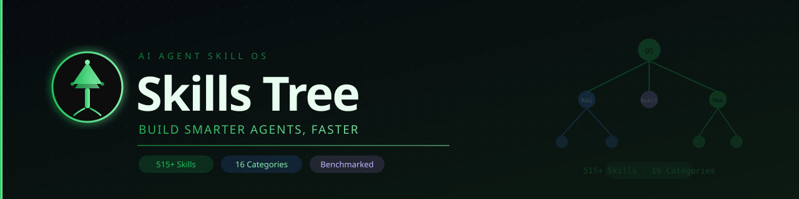

<picture>
  <source media="(prefers-color-scheme: dark)" srcset="https://raw.githubusercontent.com/SamoTech/skills-tree/main/docs/assets/logo-dark.svg">
  
</picture>

# Skills Tree

<!-- HIGHLIGHTS_START -->
## 📆 This Week's Highlights — June 8, 2026

> No skill changes this week. Open a PR to get started!

<!-- HIGHLIGHTS_END -->

### 🏗️ An AI Engineering Operating System

> **Skills Tree maps, validates, composes, and operationalizes the capabilities required to build production AI agents.**
>
> **361 skills across 17 categories** — versioned, benchmarked, and openly evolving.
> 
> **Stop rediscovering. Start building on what the community has already proven.**
>
> **51 skills are battle-tested today.** **308 are stubs** waiting for a real example, real I/O, and real failure modes — see [`meta/QUALITY-REPORT.md`](meta/QUALITY-REPORT.md) for the full list. PRs that turn a stub into a production-ready entry are the highest-impact contribution you can make.

